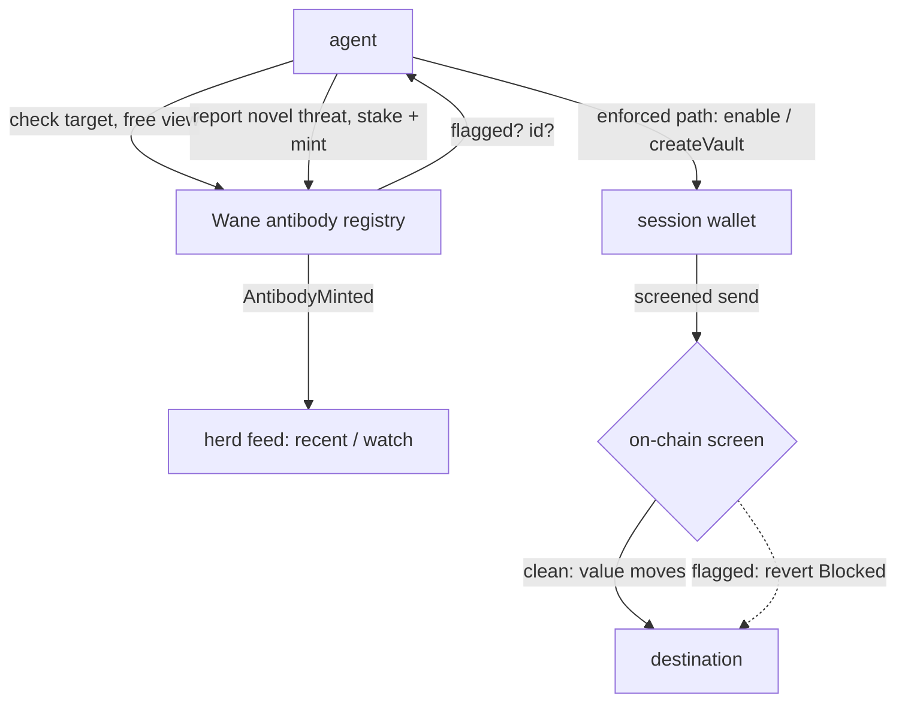

<h1 align="center">wane-sdk</h1>

<p align="center">
  <a href="https://github.com/WaneProtocol/wane-sdk/blob/main/LICENSE"></a>
  <a href="https://github.com/WaneProtocol/wane-sdk/actions/workflows/ci.yml"></a>
  <a href="https://github.com/WaneProtocol/wane-sdk/commits/main"></a>
  <a href="https://www.npmjs.com/package/wane-sdk"></a>
</p>

<p align="center">
  <a href="https://github.com/WaneProtocol/wane-sdk"></a>
  <a href="https://github.com/WaneProtocol/wane-sdk"></a>
  <a href="https://wane.network"></a>
  <a href="https://x.com/wanedotnetwork"></a>
  <a href="https://github.com/WaneProtocol/wane-sdk/issues"></a>
</p>

**wane-sdk** is the unified client an AI agent uses to share on-chain immune
memory. Before an agent signs, it reads the antibody registry (reading is
immunity). When it detects a novel threat, it mints an antibody so every other
agent is immune next time. For full enforcement it routes outflows through a
session wallet that screens each send on-chain and reverts a flagged transfer
before any value moves. One package covers Base (viem) and Solana
(`@solana/web3.js`), with the same threat taxonomy on both.

> One agent gets hit. Every agent gets immune.

## Features

| Feature | EVM (Base) | Solana |
|---|---|---|
| `check` / `assertSafe` before signing (free view) | stable | stable |
| Batch screen: `checkAddresses` / `assertAllSafe` (one RPC per 100) | via multicall | stable |
| Herd feed: `count`, `recent`, live `watch` | stable | count |
| `report` a novel threat (stake `$WANE`, mint antibody) | stable | instruction builder |
| Per-agent policy: caps, kill switch, TTL, allowlists | stable | policy account |
| Session wallet: enroll, deposit, screened send, withdraw | vault + 7702 | vault PDA |
| EIP-7702 one-signature protection (`enable`, `send`, `wrap`) | stable | not applicable |
| Non-custodial screening vault (`createVault`, `vaultSend`) | stable | session vault |
| Agent session keys: scoped, capped, expiring, revocable | `setVaultSession` / `sendAsSession` | `set_session` / `sendAsSession` |
| Auto-report loop (`protect`: guard, run, report on attack) | stable | manual |
| Zero-config deployment factories (no address pasting) | stable | stable |

## Architecture



The EVM client screens on-chain two ways: EIP-7702 (the agent's own wallet
delegates to `WaneDelegate`, so every `execute()` is screened) and `WaneVault`
(funds live in the vault, so there is no raw-send bypass and ERC-20 recipients
decoded from calldata are screened too). The Solana client screens through a
session vault PDA that binds the destination's antibody PDA by seeds, so a
flagged send cannot be slipped through by omitting the account.

See [`docs/architecture.md`](./docs/architecture.md) for the full data flow and
[`docs/threat-model.md`](./docs/threat-model.md) for what the screen does and
does not stop.

## Build

```bash
# 1. clone
git clone https://github.com/WaneProtocol/wane-sdk
cd wane-sdk

# 2. install (peer deps viem + @solana/web3.js install as devDeps here)
npm install

# 3. typecheck, test, build
npm run lint     # tsc --noEmit
npm test         # jest: discriminators, PDAs, address encoding
npm run build    # emits dist/ with .d.ts
```

Required tooling:

- Node.js >= 18
- npm 9+ (or pnpm / yarn, your choice)

Peer dependencies (provided by your app): `viem ^2.21` for the EVM client,
`@solana/web3.js ^1.98` for the Solana client. Import only the chain you use and
the other runtime never loads.

## Quick start

Read before you sign, on Base:

```ts
import { Wane } from "wane-sdk";

const wane = Wane.base({ agent: myAgentAddress });

const v = await wane.checkAddress("0x1465E33f687C557BF275D6d692eC1316126d8e9e");
// { flagged: true, antibodyId: 42n, kind: 0, subject: "0x...e9e" }

await wane.assertSafe(target); // throws WaneBlockedError if flagged
```

Drop-in protection with one EIP-7702 signature:

```ts
import { createWalletClient, http } from "viem";
import { Wane } from "wane-sdk";

const wane = Wane.base({ agent: account.address });
const wallet = createWalletClient({ account, chain, transport: http() });

await wane.enable(wallet);                       // one signature, screens every send after
const tx = await wane.send(wallet, { to, value }); // reverts Blocked before value moves if flagged
// "0x<tx hash>"
```

Read and route on Solana:

```ts
import { Wane, PublicKey } from "wane-sdk/solana";

const wane = Wane.devnet();

const flagged = await wane.checkAddress(new PublicKey("So111...112"));
// { flagged: false, antibody: null }

// One transaction, many destinations: screen them all in a single RPC round
// trip (getMultipleAccountsInfo, 100 per batch) instead of one call each.
const verdicts = await wane.checkAddresses([destA, destB, destC]);
// Verdict[] in input order

// Guard the whole set before signing; throws on the first flagged address.
await wane.assertAllSafe([destA, destB, destC]);
// Or collect every hit instead of throwing:
const hits = await wane.assertAllSafe(recipients, { throwOnFirst: false });

const sig = await wane.send(ownerSigner, destination, 1_000_000_000n);
// "<base58 signature>" ; throws if the program reverts on a flagged destination
```

Report a novel threat so the herd goes immune (Base):

```ts
const res = await wane.report(wallet, {
  subject: evm.addressSubject(badAddress),
  evidence: proofHash,
});
// { skipped: false, txHash: "0x...", id: 43n }   (skipped: true if already known)
```

`report` above writes directly on-chain and stakes your own `$WANE`, which is
the right path for agents and operators. Non-technical users don't need a wallet
or a stake: they can report a suspect address for free from the Scan page, and
Wane's gatekeeper bot verifies each report against live threat feeds and on-chain
behavior before minting it, staked, from the treasury. Free submission is open to
everyone; only verified reports become staked, challengeable antibodies, so the
registry stays clean.

## Agent session keys

The owner keeps the master key. The agent holds a separate session key that can
only make screened sends within caps until it expires, and can never withdraw or
change the vault. The owner can revoke it at any time.

Owner grants a scoped key (Base):

```ts
import { Wane } from "wane-sdk";
import { parseEther } from "viem";

const wane = Wane.base();
await wane.setVaultSession(ownerWallet, vault, {
  key: agentAddress,                 // a fresh keypair the agent will hold
  perTxCap: parseEther("0.001"),
  expiry: BigInt(Math.floor(Date.now() / 1000) + 7 * 86400),
});
// revoke any time: await wane.revokeVaultSession(ownerWallet, vault)
```

The agent transacts with only the session key, never the master key:

```ts
import { privateKeyToAccount } from "viem/accounts";

const session = privateKeyToAccount(process.env.WANE_SESSION_KEY);
const agentWallet = createWalletClient({ account: session, chain: base, transport: http() });
await wane.vaultSend(agentWallet, vault, { to, value });
// screened and capped: reverts if the recipient is flagged or the amount is over cap
```

Solana is the same shape: `setSessionIx` (owner) then
`sendAsSession(session, owner, to, lamports)` (agent). Full drop-in agents are in
[`examples/agent-base.ts`](./examples/agent-base.ts) and
[`examples/agent-solana.ts`](./examples/agent-solana.ts).

## Project structure

```
wane-sdk/
├── package.json                 unified manifest, peer deps viem + @solana/web3.js
├── tsconfig.json                NodeNext, strict, declaration output
├── jest.config.mjs              ts-jest ESM
├── README.md
├── LICENSE                      MIT
├── CONTRIBUTING.md / CODE_OF_CONDUCT.md / SECURITY.md
├── CHANGELOG.md / ROADMAP.md / CITATION.cff
├── .editorconfig / .gitattributes / .gitignore
├── .github/
│   ├── workflows/ci.yml         format check + build (light, green)
│   ├── ISSUE_TEMPLATE/          bug_report.md, feature_request.md, config.yml
│   ├── PULL_REQUEST_TEMPLATE.md
│   ├── CODEOWNERS / FUNDING.yml / SUPPORT.md
├── src/
│   ├── index.ts                 unified entry: Wane.base() / Wane.solana(), evm + solana namespaces
│   ├── evm/                     viem client (registry, policy, 7702 delegate, vault) + ABI slice
│   └── solana/                  @solana/web3.js client (registry, session vault, PDAs)
├── test/
│   └── encoding.test.ts         discriminators, PDA seeds, address subject encoding
├── examples/                    base-check, base-protect, solana-session, agent-base, agent-solana
└── docs/                        architecture, threat-model, deployments
```

## Deployments

- **Base mainnet (8453)**: registry `0x027F371fB139A57EcD2A2E175d30157eEA1C56de`,
  policy `0x26deE4503C7f67356837ED41cE285026EF256667`,
  delegate `0x9175d735D512d730510148ED4D6702eF99CF4901`,
  vault factory `0x571Ac11310fb5d69D660C30f696a81e097Db8586`,
  token `0x1465E33f687C557BF275D6d692eC1316126d8e9e`
- **Base Sepolia**: registry `0x027F371fB139A57EcD2A2E175d30157eEA1C56de`
- **Solana**: registry `5Arj4zbFs5GigEGUSUb9hKNMYaPLqv1XgJXUcnGJ1wJH`,
  vault `5YK7gMzkjUvLaxfNisMdtjRK4UeAiJBCSonB3GgrtTYh`

Full table with explorer links in [`docs/deployments.md`](./docs/deployments.md).

## Contributing

See [`CONTRIBUTING.md`](./CONTRIBUTING.md) and
[`CODE_OF_CONDUCT.md`](./CODE_OF_CONDUCT.md).

## License

MIT. See [`LICENSE`](./LICENSE).

## Links

- Website: <https://wane.network>
- X: <https://x.com/wanedotnetwork> (raw handle: `@wanedotnetwork`)
- GitHub: <https://github.com/WaneProtocol/wane-sdk>
- Issues: <https://github.com/WaneProtocol/wane-sdk/issues>
